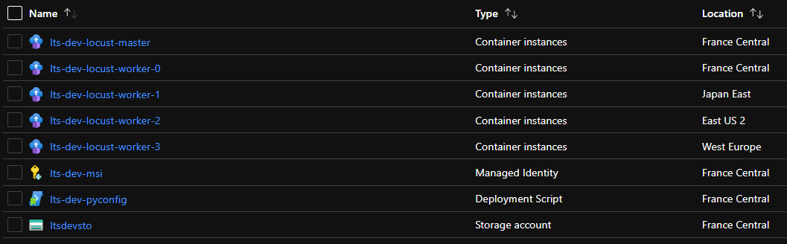

# Introduction
Last week thanks to [this](https://www.jeanpaulsmit.com/2021/05/azure-api-management-performance-testing-with-locust/) post of Jean-Paul Smit I discovered [Locust](https://locust.io/), a simple and effective tool to perform load tests.

You can already find different examples of IaC scripts to deploy an AzureContainerInstances-based infrastructure to run Locust. Here some examples.

| Scenario and Technologies                                                      | Link                                                                                |
|--------------------------------------------------------------------------------|-------------------------------------------------------------------------------------|
| Headless Locust deployed with az CLI + ARM template                            | [GitHub](https://github.com/yorek/locust-on-azure/blob/master/azure-deploy.sh)      |
| Headless Locust deployed  with az CLI + ARM with VNET connectivity (via appgw) | [GitHub](https://github.com/yorek/locust-on-azure/blob/master/azure-vnet-deploy.sh) |
| Web UI Locust deployed with Terraform                                          | [GitHub](https://github.com/heoelri/locust-on-aci/tree/main/src/testing)            |
| Headless Locust deployed with Terraform                                        | [GitHub](https://github.com/heoelri/locust-on-aci/tree/main/src/headless)           |


**The goal of this exercise** is to deploy a Locust WebUI test infrastructure using [Bicep](https://github.com/Azure/bicep).
- a secondary goal was to not use additional scripts (bicep only) but unfortunately we need to copy the python script to the file share. The ARM DeploymentStripts is used to copy the file to the Storage Account share.
- DeploymentStripts introduces a lot of un-necessary complexity just to copy a single file (the same task [simple](https://github.com/heoelri/locust-on-aci/blob/7a49613a195a258b4ca6032e0abaafd6ccd358c0/src/headless/infra/storage.tf#L29) in Terraform). 


# Architecture


# Deployment
- create a resource group.
- run the az deployment command to target the bicep orcestrator file (00main.bicep) specifying the following parameters.
    - appId : prefix to name the different artifacts.
    - targetHost : hostname of the loadtest target
    - nrOfWorkers : number of locust workers [default value: 4]
    - environment [default value : dev] 
    - randomizeLocation : whether to randomize the locations of the locust workers [default value : true 

The locust master and all the support artifacts (storage account, deployment scripts, etc..) are created in the same location of the resource group.

```
$rgname = 'rg-laodtest'
az group create -n $rgname -l "francecentral"

az deployment group create -f ./00main.bicep -g $rgname 
    -p appId=lts 
    -p targetHost=lnl-webfront-afd.azurefd.net
```

result of the deployment



# Run Load Test
The Locus web interface is available at this URL : http://lts-dev-locust-master.francecentral.azurecontainer.io:8089/


# Conclusions

