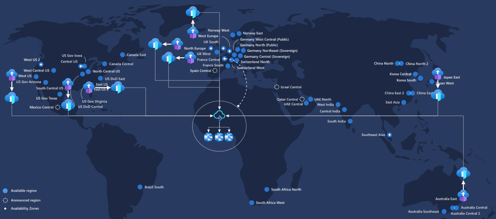
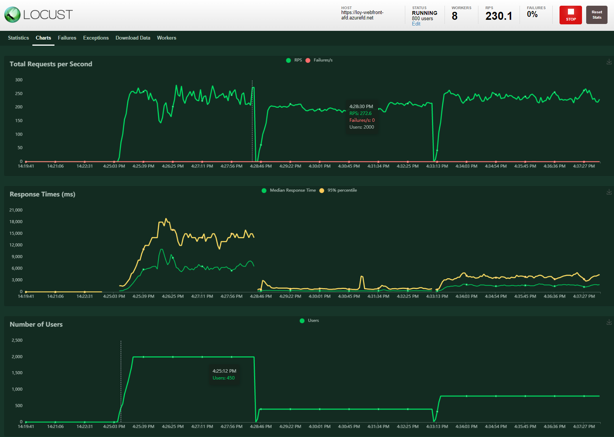
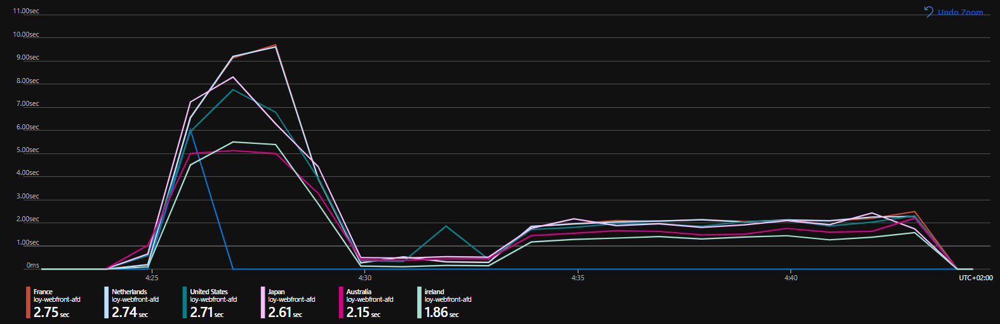
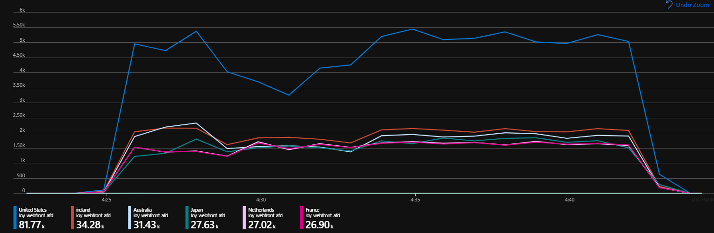
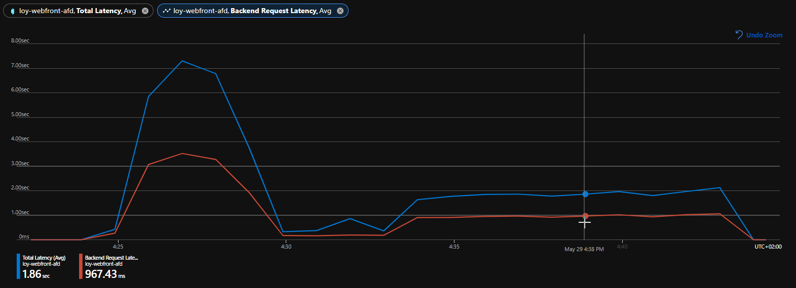
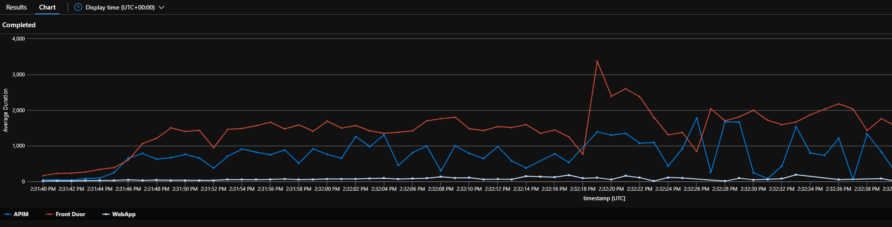
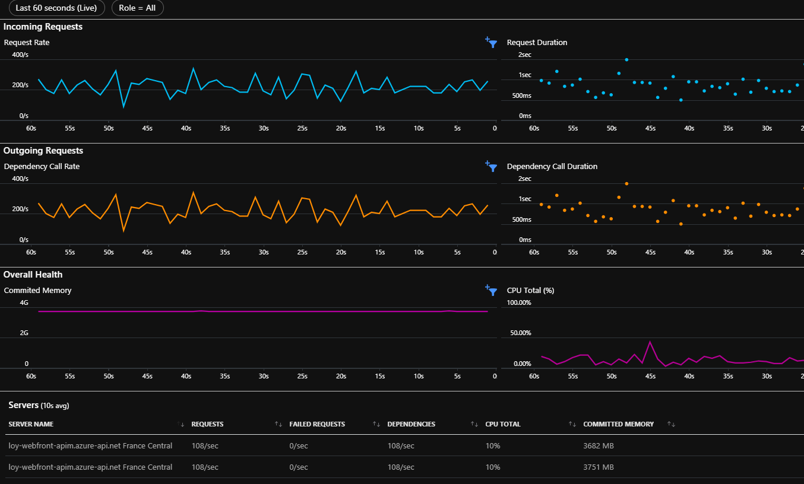

# Introduction
Last week thanks to [this](https://www.jeanpaulsmit.com/2021/05/azure-api-management-performance-testing-with-locust/) post of Jean-Paul Smit I discovered [Locust](https://locust.io/), a simple and effective tool to perform load tests.

You can already find different examples of IaC scripts to deploy an AzureContainerInstances-based infrastructure to run Locust. Here some examples.

| Scenario and Technologies                                                      | Link                                                                                |
|--------------------------------------------------------------------------------|-------------------------------------------------------------------------------------|
| Headless Locust deployed with az CLI + ARM template                            | [GitHub](https://github.com/yorek/locust-on-azure/blob/master/azure-deploy.sh)      |
| Headless Locust deployed  with az CLI + ARM with VNET connectivity (via appgw) | [GitHub](https://github.com/yorek/locust-on-azure/blob/master/azure-vnet-deploy.sh) |
| Web UI Locust deployed with Terraform                                          | [GitHub](https://github.com/heoelri/locust-on-aci/tree/main/src/testing)            |
| Headless Locust deployed with Terraform                                        | [GitHub](https://github.com/heoelri/locust-on-aci/tree/main/src/headless)           |


**The goal of this exercise** is to deploy a Locust WebUI test infrastructure using [Bicep](https://github.com/Azure/bicep).
- a secondary goal was to not use additional scripts (bicep only) but unfortunately ARM do not provide the functionality to copy a file (the python script) to the file share. The ARM DeploymentStripts is used for that purpose.
- DeploymentStripts introduces a lot of un-necessary complexity. It's crazy to have to create MSI, ACI and a storage to simply upload a file to a share (the same task is extremely [simple](https://github.com/heoelri/locust-on-aci/blob/7a49613a195a258b4ca6032e0abaafd6ccd358c0/src/headless/infra/storage.tf#L29) in Terraform or using the az cli). 


# Architecture


# Deployment
- create a resource group.
- run the az deployment command to target the bicep orcestrator file (00main.bicep) specifying the following parameters.
    - appId : prefix to name the different artifacts.
    - targetHost : hostname of the loadtest target
    - nrOfWorkers : number of locust workers [default value: 4]
    - environment [default value : dev] 
    - randomizeLocation : whether to randomize the locations of the locust workers [default value : true 

The locust master and all the support artifacts (storage account, deployment scripts, etc..) are created in the same location of the resource group.

```
$rgname = 'rg-laodtest'
az group create -n $rgname -l "francecentral"

az deployment group create -f ./00main.bicep -g $rgname 
    -p appId=lts 
    -p targetHost=lnl-webfront-afd.azurefd.net
```

result of the deployment


# Run Load Test
The Locus web interface is available at this URL : http://{appId }-{environment}-locust-master.{location}.azurecontainer.io:8089/ (http://lts-dev-locust-master.francecentral.azurecontainer.io:8089/)

For this exercise, I used Locust to test a AFD+APIM+APPSVC [infrastructure](https://github.com/MassimoC/front-door-apim-appservice).
 - Azure Front Door (Classic - Global)
 - Azure API Management (Premium - France Central)
 - Azure App Service (3x P1V2 - France Central)
 - Locust (8 workers : 'francecentral', 'japaneast', 'eastus2', 'westeurope', 'northeurope', 'westus', 'australiaeast', 'southcentralus')



3 run has been triggered with 2000, 400 and 800 users.


Northeurope have the better total latency (avg)


The metrics are split by 'Client Country'. 3 workers are in the US.


I was not expecting this latency from AFD


Avg duration per component during the run with 800 users.


APIM cpu (10%) during the run with 800 users 


# Conclusions

